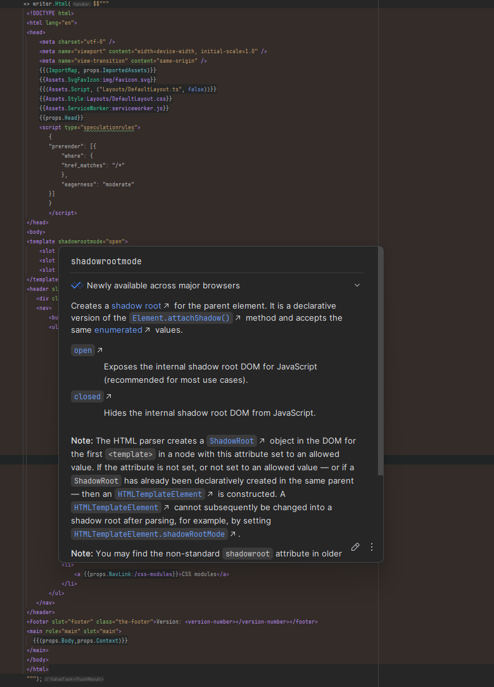

# MinimalHtml

A high-performance, AOT-compatible HTML template library for .NET 9 that leverages C# `StringInterpolationHandler` and `System.IO.Pipelines` for efficient streaming HTML generation.

## Features

- **🚀 High Performance**: Direct `PipeWriter` streaming with minimal allocations
- **🔒 AOT Compatible**: Full support for Native AOT compilation
- **🛡️ XSS Protection**: Automatic HTML encoding for all interpolated values
- **🎨 IDE Support**: Full HTML syntax highlighting in JetBrains Rider: 

## Quick Start

### Installation

```bash
dotnet add package MinimalHtml
dotnet add package MinimalHtml.AspNetCore  # For ASP.NET Core integration
```

### Basic Usage

```csharp
using MinimalHtml;

// Define a template as a static method or property
public static readonly Template<User> UserTemplate = 
    (writer, user) => writer.Html($"""
        <div class="user-card">
            <h2>{user.Name}</h2>
            <p>{user.Email}</p>
        </div>
        """);

// Use in ASP.NET Core
app.MapGet("/user/{id}", (int id, UserService users) =>
{
    var user = users.GetById(id);
    return Results.Html(UserTemplate, user);
});
```

## Security

All template interpolations are automatically HTML-encoded to prevent XSS attacks:

```csharp
var userInput = "<script>alert('xss')</script>";
writer.Html($"<p>User said: {userInput}</p>");
// Outputs: <p>User said: &lt;script&gt;alert(&#39;xss&#39;)&lt;/script&gt;</p>
```

## Performance

MinimalHtml is designed for maximum performance:

- **Streaming templates**: Improved Time to First Byte (TTFB) by sending content as it's generated ([example](https://sample.minimalhtml.net/any-order))
- **Zero allocation string literals**: Cached as UTF-8 byte arrays
- **Direct PipeWriter streaming**: No intermediate string building
- **Source generation**: Templates pre-compiled when possible
- **AOT friendly**: No runtime compilation or reflection

### Template Caching Setup

For optimal performance, enable UTF-8 byte array caching of string literals using the source generator:

1. Create a template cache class:
```csharp
using MinimalHtml;

public static partial class TemplateCache
{
    [FillTemplateCache]
    public static partial void Cache();
}
```

2. Initialize the cache in your Program.cs:
```csharp
// Initialize template cache for optimal performance (skip in debug for Hot Reload compatibility)
#if !DEBUG
TemplateCache.Cache();
#endif

var builder = WebApplication.CreateBuilder(args);
var app = builder.Build();

app.MapGet("/", () => Results.Html($"<h1>Hello World!</h1>"));
app.Run();
```

The source generator will automatically populate this class with cached UTF-8 byte arrays for all string literals found in your templates, significantly improving performance by eliminating encoding overhead.

## Benchmarks

Run the included benchmarks:

```bash
dotnet run --project benchmark/MinimalHtml.Benchmarks.csproj -c Release
```

## Requirements

- .NET 9.0 or later
- C# 12.0 or later

## License

This project is licensed under the MIT License. See the LICENSE file for details.

## Related Projects

- [ASP.NET Core](https://github.com/dotnet/aspnetcore) - Web framework integration
- [System.IO.Pipelines](https://github.com/dotnet/corefx) - High-performance I/O

---

**MinimalHtml** - High-performance HTML templating for modern .NET applications.